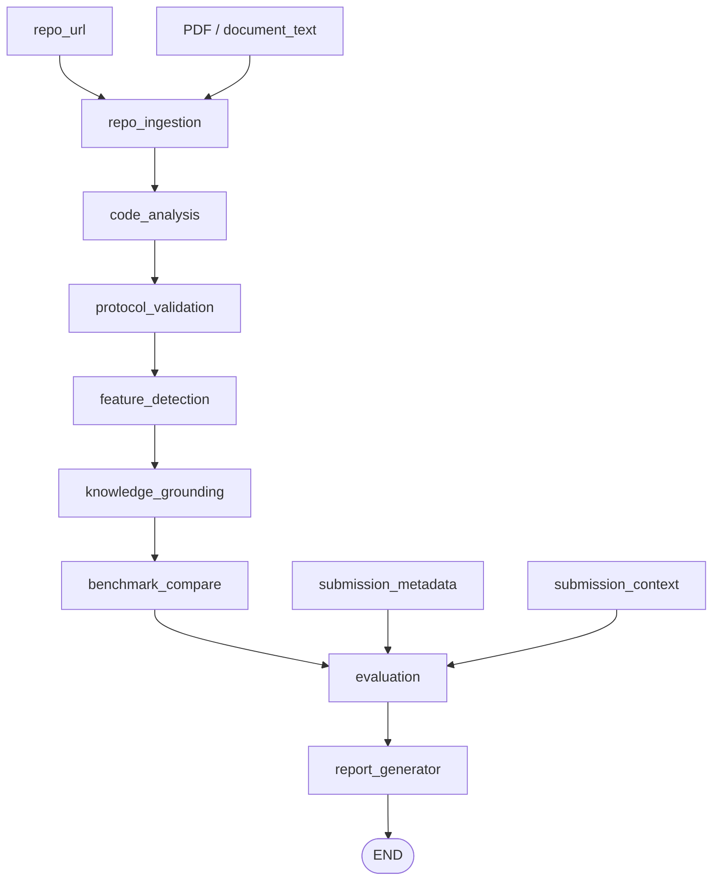

# Hackathon Evaluator

Production-style judge for hackathon submissions (Fetch.ai / uAgents / ASI:One patterns): **GitHub repos**, optional **PDFs**, and **free-form metadata** (team name, table, or any event-specific columns). The backend runs a **LangGraph** pipeline (clone and/or document text → heuristics → optional RAG → LLM) and returns structured JSON via **FastAPI** and **Next.js 14**.

**Source:** [github.com/gautammanak1/hackathon-evaluator](https://github.com/gautammanak1/hackathon-evaluator)

## What it does

- **Repository:** clone and scan source for uAgents, protocols, LLM usage.
- **PDF:** extract text with `pypdf` (text-based PDFs; scanned pages need OCR elsewhere).
- **Together:** repo + PDF appends extracted text to the excerpt so both code and write-up are judged.
- **Metadata:** arbitrary JSON (`submission_metadata`) — e.g. `team_name`, `table_name`, track, school. **No fixed schema**; your event defines keys. Values are echoed in the report and passed to the judge.
- **Bulk file:** `POST /evaluate/batch/upload` with a **.csv** or **.xlsx** (first sheet). One column must be a GitHub URL: `repo_url`, `url`, `repository`, or `repo`. Optional `branch` / `ref`. **Every other column** becomes `submission_metadata` for that row (team, table, track, etc.). Up to **100** rows per file. JSON batch `POST /evaluate/batch` remains available (max 40 items).

## Tech stack

| Area | Choice |
|------|--------|
| Workflow | LangGraph (`backend/hackathon_eval/graph.py`) |
| API | FastAPI (`backend/main.py`) |
| PDF | `pypdf` (`backend/hackathon_eval/pdf_extract.py`) |
| LLM / embeddings | OpenAI (via LangChain) |
| Frontend | Next.js 14 (`frontend/`) |

## Repository layout

```
backend/hackathon_eval/   # graph, nodes, scanner, RAG, pdf_extract, prompts
backend/main.py
backend/prompts/static/
frontend/
tests/
examples/
requirements.txt
.env.example
```

## LangGraph workflow

| Step | Node | Responsibility |
|------|------|----------------|
| 1 | `repo_ingestion` | Clone when `repo_url` is set; otherwise use PDF/document text only. If clone fails but a PDF was provided, fall back to PDF text. |
| 2 | `code_analysis` | Scan combined excerpt (code + appended PDF text). |
| 3 | `protocol_validation` | Heuristic chat/payment signals (static analysis). |
| 4 | `feature_detection` | uAgents / LLM / protocol flags. |
| 5 | `knowledge_grounding` | RAG over local Innovation Labs docs if configured. |
| 6 | `benchmark_compare` | Optional similarity vs good/bad corpora. |
| 7 | `evaluation` | LLM structured output (or heuristic without API key). Receives `SUBMISSION_METADATA`, `SUBMISSION_CONTEXT`, excerpt. |
| 8 | `report_generator` | `report_v2` + legacy flattening for the UI. |



## HTTP API

| Method | Path | Description |
|--------|------|-------------|
| GET | `/health` | Liveness. |
| POST | `/evaluate` | JSON: at least one of **`repo_url`**, **`document_text`**. Optional: `branch`, `submission_context`, **`submission_metadata`** (object). |
| POST | `/evaluate/submission` | **Multipart:** `repo_url`, `branch`, `pdf`. Response: **`mode`** `single` (**`evaluation`**) or **`batch`** (**`results`**, **`count`**) when extracted PDF text contains **2+** `github.com` repo links (e.g. Google Sheets export)—**even if** `repo_url` is set; the field is ignored for batch PDFs and a **`notice`** explains that. **pdfplumber** is used when pypdf output is short **or** when switching to pdfplumber finds **more** repo links (table exports often merge cells in pypdf). |
| POST | `/evaluate/batch` | JSON `items` array (max **40**). Each item: at least one of `repo_url` / `document_text`; optional metadata fields. |
| POST | `/evaluate/batch/upload` | **Multipart:** single `file` — `.csv` or `.xlsx`, URL column + any extra columns → metadata (max **100** rows). |

## Report fields and ranking

Use these when sorting or exporting leaderboards (your app can sort by `quality_score`, `report_v2.score`, or axis averages).

| Field | Meaning |
|--------|--------|
| **`quality_score`** / **`report_v2.score`** | Blended 0–10-style headline score (axis mean + heuristic rolled into one number for the UI). |
| **`classification`** | Coarse bucket from LLM/heuristic: Poor / Average / Good (etc.). |
| **`scores`** | Per-axis 0–10: `architecture`, `protocols`, `ai_usage`, `code_quality`, `innovation`. |
| **`features`** | Booleans: uAgents, chat protocol, payment protocol, LLM integration (from heuristics). |
| **`protocol_validation`** | `valid` / `invalid` / `unknown` for chat/payment from static text — not a runtime security audit. |
| **`benchmark`** | Optional cosine similarity vs reference corpora: `closest_match`, `confidence`, `similarity_good` / `similarity_bad`. |
| **`problem_solved`** / **`solution_overview`** | LLM narrative grounded in excerpt + context. |
| **`submission_metadata`** | **Echo** of whatever you sent (`team_name`, `table_name`, custom keys). **Does not change math scores** by itself; use it for display, filtering, and tie-breaks in your own tooling. |
| **`issues`**, **`notes`**, **`summary`** | Heuristic issues + judge text. |

**PDF-only runs:** heuristic feature flags may be weak (no code); rely more on **`classification`**, narratives, and manual review for ranking.

## Deploy (Render + Vercel)

Same GitHub repo: **API on [Render](https://render.com)** (`render.yaml`), **UI on [Vercel](https://vercel.com)** with project root `frontend/`. Step-by-step: [DEPLOY.md](./DEPLOY.md). CI: `.github/workflows/ci.yml`.

## Quick start

```bash
python3 -m venv .venv && source .venv/bin/activate
pip install -r requirements.txt && pip install -e .
cp .env.example .env   # OPENAI_API_KEY + optional doc paths

uvicorn main:app --app-dir backend --host 0.0.0.0 --port 8000
```

```bash
cd frontend && cp .env.example .env.local && npm install && npm run dev
```

Set `NEXT_PUBLIC_API_URL` to the API. The UI: one GitHub URL and/or PDF, or a **CSV / Excel** bulk upload with a URL column and any extra columns you need.

## Security and operations

- Secrets in `.env` or a secret manager; never commit keys.
- Service may **clone arbitrary GitHub URLs** and **read uploaded PDFs**; isolate network and disk quotas as needed.
- Payloads (repo + PDF + metadata) may be sent to **OpenAI** when configured.
- **CORS:** set `API_CORS_ORIGINS` to real frontend origins in production.
- **`MAX_DOCUMENT_TEXT_CHARS`** / **`MAX_PDF_APPEND_CHARS`** — defaults in code (`hackathon_eval` / `graph_nodes`); override in env if needed.

## Tests

```bash
pytest tests/ -v -k "not full_graph"
```

## Optional: doc URL manifest

```bash
python backend/scripts/build_doc_url_manifest.py /path/to/innovation-labs/docs \
  --out backend/prompts/doc_url_manifest.json
```

Override with `DOC_URL_MANIFEST` if needed.
